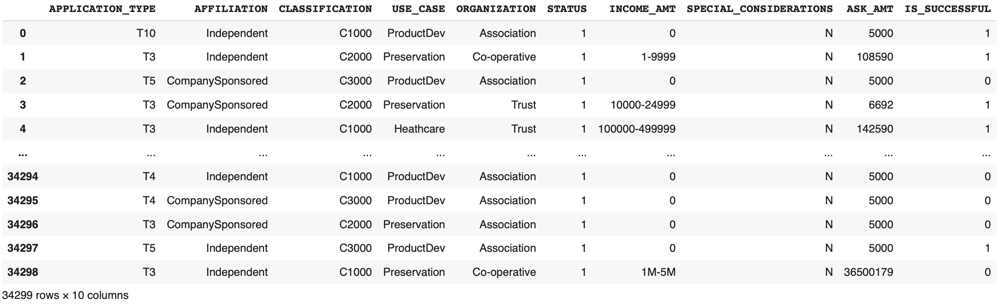
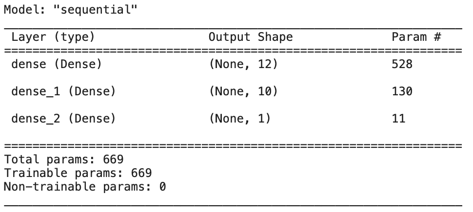
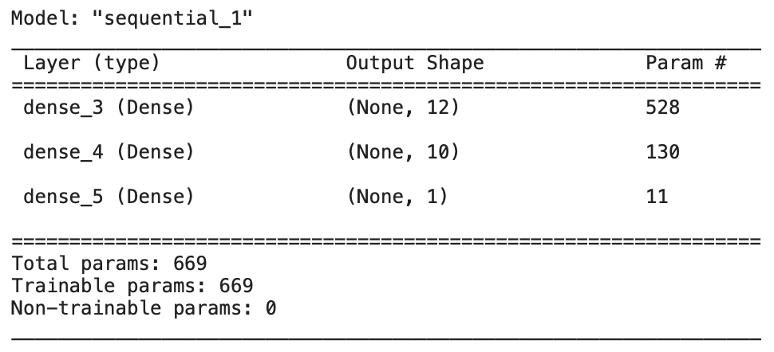
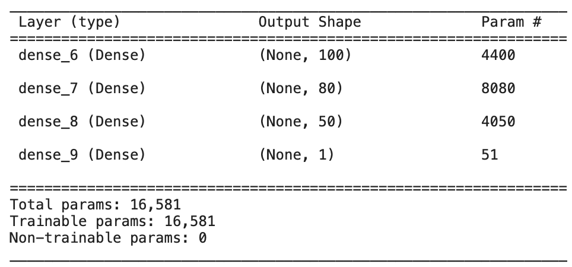
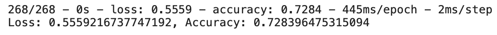
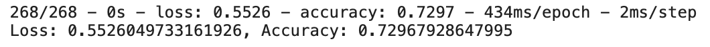
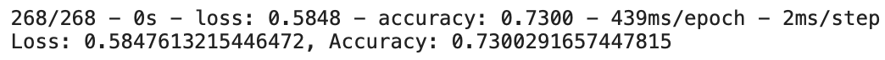
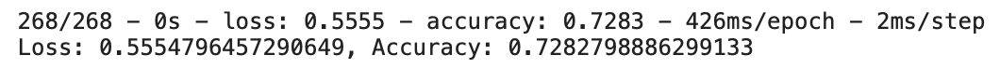

# Alphabet Soup Charity with Neural Network and Depp Learning

***University of Toronto - Data Analytics Boot Camp - Module 20 - Neural Networks and Deep Learning Models***

---

## Overview

There is a dataset containing the some charactristics of different Charities. The goal is to create a classifier that can predict wheter wheter lending money to a Charity will be successful or not. In other word, we are predicting loan risk and decide wheter a loan application should be accepted or not.

We will be using Deep Neural Network models to create this binary classifier. We will aim for 75+% accuracy which might not be achieved since the dataset is designed to have accuracy less than 75%.

---

## Results

* **Data Preprocessing**
  * **What variable(s) are considered the target(s) for your model?**  
    Target feature is "IS_SUCCESSFUL" column. The goal is to predict this feature (Wheter a loan will be successful or not?  
    
---

  * **What variable(s) are considered to be the features for your model?**  
    Except the "EIN" and "NAME" columns which are identification features and cannot add value to analysis, and target feature, I kept all other columns in the analysis. Input features are APPLICATION_TYPE, AFFILIATION, CLASSIFICATION, USE_CASE, ORGANIZATION, STATUS, INCOME_AMT, SPECIAL_CONSIDERATIONS, ASK_AMT.  
        
---

  * **What variable(s) are neither targets nor features, and should be removed from the input data?**  
  I have tried feature reduction and removed features like "STATUS" and "SPECIAL_CONSIDERATIONS" but the accuracy got worse. Thus I decided to keep them in analysis. Therefore, the only variables that not included in analysis were "EIN" and "NAME".   
   

---

* **Compiling, Training, and Evaluating the Model**  
  * **How many neurons, layers, and activation functions did you select for your neural network model, and why?**  
  I have build 4 different models. the information are as below.
    1. Input with 12 neurons and a hidden layer with 10 neurons. 
   
    2. Input with 12 neurons and a hidden layer with 10 neurons. 
   
    3. Input with 100 neurons and two hidden layer with 80 and 50 neurons. 
   
    4. Input with 12 neurons and two hidden layer with 10 and 8 neurons. 
   
      
---

  * **Were you able to achieve the target model performance?**  
  The performance of my models are as below. 
    * **Model 1**
   
    * **Model 2**
   
    * **Model 3**
   
    *. **Model 4**
   
  The models could not achieve 75+% accuraccy.
      
---

  * **What steps did you take to try and increase model performance?**  
  I have done 3 attempts to incerease the model performance which had no significant effect.
    1. Dealing with ASK_AMT feature. Since the datapoints in this feature are mostly 5000, I converted this feature to a binary feature with 0 (amounts equal or less than 5000) and 1 (amounts wih more than 5000).
    2. In this attempt I have increased number of layers and neurons.
    3. In this attempt I have increased the number of layers and changed the activation functions.
  
  ---
  
  ## Summary
  
  The model performance is just below 75%. Performance of each model as below.
  The performance of my models are as below. 
    * **Model 1**
   
    * **Model 2**
   
    * **Model 3**
   
    *. **Model 4**
   
  
  As it is obvious, results are almost identical.
  
  ---
  
  ## Recommendation
  
  I reckon there is a problem with the dataset and in order to find it, we have to run some in-depth EDAs.
  Modeling, activation functions, number of layers and neurons has no issue in my point of view. I even used a Perceptron and the result was very very close to the most complicated model I have created.
